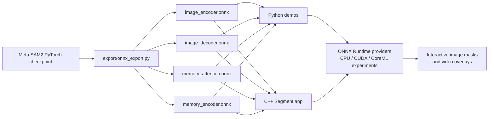
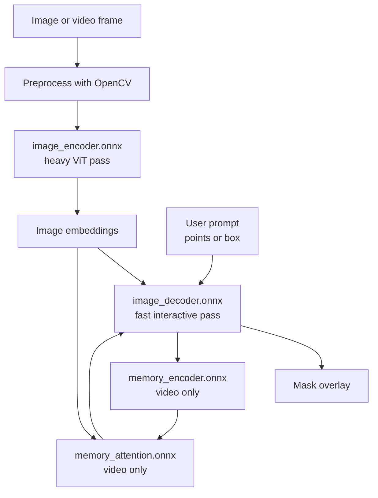

# sam2-onnx-cpp

SAM2 ONNX demos for Python and C++.

This repository is set up to show SAM2 running through ONNX Runtime on images and
videos, with interactive point and box prompts. The default demo preset is:

- Model: `base_plus`
- Python demos: `python/onnx_test_image.py`, `python/onnx_test_video.py`
- C++ app: `Segment`
- Image prompts: seed points or bounding boxes
- Video prompts: annotate the first frame, then propagate

For live demos on CPU, keep video short with `--max_frames 5`, `10`, or `20`.

## Table Of Contents

- [How The Pieces Fit](#how-the-pieces-fit)
- [ONNX Export Strategy](#onnx-export-strategy)
- [Why ONNX?](#why-onnx)
- [Repository Layout](#repository-layout)
- [Demo Controls](#demo-controls)
- [macOS Workflow](#macos-workflow)
- [Windows Workflow](#windows-workflow)
- [Runtime Variables](#runtime-variables)
- [Demo Notes](#demo-notes)
- [Known Issues And Next Steps](#known-issues-and-next-steps)
- [Acknowledgements](#acknowledgements)
- [License](#license)

## How The Pieces Fit



At runtime, image segmentation uses the encoder once and then reuses the prompt
decoder for each click or box. Video segmentation adds memory attention and a
memory encoder so masks can propagate through frames.



## ONNX Export Strategy

The export step is where the research model becomes a portable runtime. Instead
of exporting SAM2 as one large ONNX graph, this repo cuts the PyTorch model into
small contracts that are easier to load from Python or C++:

- `image_encoder.onnx`: the heavy ViT pass from pixels to embeddings.
- `image_decoder.onnx`: prompts plus embeddings to masks, so clicks and boxes
  stay interactive after the encoder has run once.
- `memory_attention.onnx` and `memory_encoder.onnx`: the video state machinery
  that lets masks propagate across frames.

This split mirrors the way SAM2 is used interactively: pay the encoder cost once,
then run the lightweight prompt decoder many times. It also keeps the C++ layer
simple. The app does not need PyTorch or SAM2 internals; it only preprocesses
images with OpenCV, feeds named ONNX inputs, and renders the returned masks.

## Why ONNX?

Native PyTorch is still the best reference path for research and model changes.
The ONNX path is useful when the goal is deployment:

- Python ONNX validates the exported graph before debugging C++ runtime code.
- Python and C++ consume the same `.onnx` files, so both demos exercise the same
  model contracts.
- Runtime machines do not need a full PyTorch/SAM2 environment.
- ONNX Runtime gives one deployment API across CPU, CUDA, DirectML, TensorRT, and
  experimental CoreML paths.
- Explicit graph inputs and outputs make performance easier to profile: encoder,
  decoder, memory attention, and memory encoder can be timed separately.

## Repository Layout

```text
sam2-onnx-cpp/
|-- checkpoints/
|   `-- base_plus/
|-- cpp/
|   |-- CMakeLists.txt
|   `-- src/
|-- export/
|   `-- onnx_export.py
|-- python/
|   |-- onnx_test_image.py
|   |-- onnx_test_video.py
|   `-- benchmark_onnx_variants.py
|-- sam2/
|-- fetch_sparse.bat
|-- fetch_sparse.sh
`-- README.md
```

## Demo Controls

Seed points:

- Left click: foreground point
- Right click: background point
- Middle click: clear
- `Esc`: quit

Bounding box:

- Drag left mouse button: draw box
- Right or middle click: clear
- `Esc`: quit

If `--image` or `--video` is omitted, the demo opens a file selector.

## macOS Workflow

These commands assume Apple Silicon with Homebrew in `/opt/homebrew`.

### 1. Create the Python environment

```bash
cd /Users/pgarcia/Documents/sam2-onnx-cpp
python3 -m venv sam2_env
source sam2_env/bin/activate
python -m pip install --upgrade pip
python -m pip install torch onnx onnxruntime onnxscript hydra-core iopath pillow opencv-python pyqt5
```

### 2. Fetch SAM2 source assets

```bash
chmod +x fetch_sparse.sh
./fetch_sparse.sh
```

### 3. Export the ONNX models

```bash
source sam2_env/bin/activate
python export/onnx_export.py --model_size base_plus
```

This should populate:

```text
checkpoints/base_plus/image_encoder.onnx
checkpoints/base_plus/image_decoder.onnx
checkpoints/base_plus/memory_attention.onnx
checkpoints/base_plus/memory_encoder.onnx
```

Optional CPU companion artifact:

```bash
python python/quantize_image_encoder.py --model_size base_plus
```

### 4. Run Python image demos

```bash
source sam2_env/bin/activate

python python/onnx_test_image.py \
  --model_size base_plus \
  --prompt seed_points

python python/onnx_test_image.py \
  --model_size base_plus \
  --prompt bounding_box
```

To avoid the file selector:

```bash
python python/onnx_test_image.py \
  --model_size base_plus \
  --prompt bounding_box \
  --image ../sam2/notebooks/images/truck.jpg
```

### 5. Run Python video demos

Keep CPU demos short:

```bash
python python/onnx_test_video.py \
  --model_size base_plus \
  --prompt seed_points \
  --max_frames 20 \
  --session_warmup 0

python python/onnx_test_video.py \
  --model_size base_plus \
  --prompt bounding_box \
  --max_frames 20 \
  --session_warmup 0
```

The output video is written next to the selected input video.

### 6. Build C++ on macOS

Install OpenCV with Homebrew:

```bash
brew install opencv
```

Download or unpack ONNX Runtime for macOS arm64, then point CMake at it. Example:

```bash
cd /Users/pgarcia/Documents/sam2-onnx-cpp/cpp

cmake -S . -B build_release \
  -DOpenCV_DIR="$(brew --prefix opencv)/lib/cmake/opencv4" \
  -DONNXRUNTIME_DIR="/opt/onnxruntime-osx-arm64-1.23.2"

cmake --build build_release --target Segment --clean-first
cmake --install build_release --prefix package
```

The packaged app is:

```text
cpp/package/Segment.app/Contents/MacOS/Segment
```

### 7. Run C++ demos on macOS

```bash
cd /Users/pgarcia/Documents/sam2-onnx-cpp

SEG=cpp/package/Segment.app/Contents/MacOS/Segment
CKPT=checkpoints/base_plus
```

Image:

```bash
"$SEG" --onnx_test_image \
  --prompt seed_points \
  --encoder "$CKPT/image_encoder.onnx" \
  --decoder "$CKPT/image_decoder.onnx"

"$SEG" --onnx_test_image \
  --prompt bounding_box \
  --encoder "$CKPT/image_encoder.onnx" \
  --decoder "$CKPT/image_decoder.onnx"
```

Video:

```bash
"$SEG" --onnx_test_video \
  --prompt seed_points \
  --max_frames 20 \
  --device cpu \
  --threads 4 \
  --encoder "$CKPT/image_encoder.onnx" \
  --decoder "$CKPT/image_decoder.onnx" \
  --memattn "$CKPT/memory_attention.onnx" \
  --memenc "$CKPT/memory_encoder.onnx"
```

For a noninteractive smoke test:

```bash
"$SEG" --onnx_test_image \
  --no_gui \
  --image ../sam2/notebooks/images/truck.jpg \
  --box 90,55,230,185 \
  --encoder "$CKPT/image_encoder.onnx" \
  --decoder "$CKPT/image_decoder.onnx" \
  --device cpu \
  --save_overlay /tmp/sam2_cpp_overlay.png
```

## Windows Workflow

Run these from a PowerShell prompt.

### 1. Create the Python environment

```powershell
cd C:\path\to\sam2-onnx-cpp
python -m venv sam2_env
.\sam2_env\Scripts\Activate.ps1
python -m pip install --upgrade pip
python -m pip install torch onnx onnxruntime onnxscript hydra-core iopath pillow opencv-python pyqt5
```

For ONNX Runtime CUDA:

```powershell
python -m pip uninstall -y onnxruntime
python -m pip install onnxruntime-gpu
```

### 2. Fetch SAM2 source assets

```powershell
.\fetch_sparse.bat
```

### 3. Export the ONNX models

```powershell
.\sam2_env\Scripts\python.exe .\export\onnx_export.py --model_size base_plus
```

Optional CPU companion artifact:

```powershell
.\sam2_env\Scripts\python.exe .\python\quantize_image_encoder.py --model_size base_plus
```

### 4. Run Python demos on Windows

Image:

```powershell
.\sam2_env\Scripts\python.exe .\python\onnx_test_image.py `
  --model_size base_plus `
  --prompt seed_points

.\sam2_env\Scripts\python.exe .\python\onnx_test_image.py `
  --model_size base_plus `
  --prompt bounding_box
```

Video:

```powershell
.\sam2_env\Scripts\python.exe .\python\onnx_test_video.py `
  --model_size base_plus `
  --prompt seed_points `
  --max_frames 20 `
  --session_warmup 0
```

To force CPU behavior on a GPU machine:

```powershell
$env:SAM2_ORT_RUNTIME_PROFILE = "cpu_lowcost"
```

Unset it:

```powershell
Remove-Item Env:SAM2_ORT_RUNTIME_PROFILE -ErrorAction SilentlyContinue
```

### 5. Build C++ on Windows

Install:

- Visual Studio 2022 with C++ tools
- CMake
- OpenCV
- ONNX Runtime for Windows

Configure and build:

```powershell
cd C:\path\to\sam2-onnx-cpp\cpp

cmake -S . -B build_release -G "Visual Studio 17 2022" -A x64 `
  -DCMAKE_CONFIGURATION_TYPES=Release `
  -DOpenCV_DIR="C:\path\to\opencv\build" `
  -DONNXRUNTIME_DIR="C:\path\to\onnxruntime-win-x64-1.23.2"

cmake --build .\build_release --config Release --target Segment -- /m:1
```

For GPU deployment, point `ONNXRUNTIME_DIR` at an ONNX Runtime GPU package and make
sure CUDA/cuDNN runtime DLLs are available to the executable.

### 6. Run C++ demos on Windows

From the repo root:

```powershell
$seg = ".\cpp\build_release\bin\Release\Segment.exe"
$ckpt = ".\checkpoints\base_plus"
```

Image:

```powershell
& $seg --onnx_test_image `
  --prompt seed_points `
  --encoder "$ckpt\image_encoder.onnx" `
  --decoder "$ckpt\image_decoder.onnx"

& $seg --onnx_test_image `
  --prompt bounding_box `
  --encoder "$ckpt\image_encoder.onnx" `
  --decoder "$ckpt\image_decoder.onnx"
```

Video:

```powershell
& $seg --onnx_test_video `
  --prompt seed_points `
  --max_frames 20 `
  --encoder "$ckpt\image_encoder.onnx" `
  --decoder "$ckpt\image_decoder.onnx" `
  --memattn "$ckpt\memory_attention.onnx" `
  --memenc "$ckpt\memory_encoder.onnx"
```

Noninteractive image smoke test:

```powershell
& $seg --onnx_test_image `
  --no_gui `
  --image ".\sam2\notebooks\images\truck.jpg" `
  --box 90,55,230,185 `
  --encoder "$ckpt\image_encoder.onnx" `
  --decoder "$ckpt\image_decoder.onnx" `
  --save_overlay ".\tmp\sam2_cpp_overlay.png"
```

## Runtime Variables

| Variable | Values | Use |
| --- | --- | --- |
| `SAM2_ORT_ACCEL` | `auto`, `cpu`, `cuda`, `coreml` | Python provider selection. |
| `SAM2_ORT_RUNTIME_PROFILE` | `cpu_lowcost` | Force CPU and lean settings. |
| `SAM2_ORT_ENCODER_VARIANT` | `auto`, `fp32`, `int8` | Select encoder artifact. |
| `SAM2_ORT_VIDEO_MODULE_VARIANT` | `fp32`, `int8`, `auto` | Select video module artifacts. |
| `SAM2_ORT_CPU_THREADS` | integer | Override CPU thread count. |
| `SAM2_ORT_VIDEO_MAX_MEMORY_FRAMES` | integer | Override video memory-frame cap. |
| `SAM2_ORT_VIDEO_MAX_OBJECT_POINTERS` | integer | Override object-pointer cap. |

## Demo Notes

- SAM2 image encoder is the expensive step; interactive decoder calls should be much faster.
- On CPU video, every propagated frame still pays encoder and memory-attention cost.
- Use `--max_frames` for live demos.
- If a GUI picker is awkward during a talk, pass `--image` or `--video`.
- Keep canonical FP32 paths in commands. CPU fallback can still resolve an INT8 encoder when available.

## Known Issues And Next Steps

- macOS is currently best treated as a CPU demo path. ONNX Runtime may expose a
  CoreML provider, but CoreML acceleration still needs explicit validation,
  especially for the encoder and fallback behavior.
- CPU video is slow because every propagated frame still runs the encoder plus
  memory attention. Future work should focus on better frame selection, cached
  embeddings, quantized video modules, or a validated GPU/CoreML path.
- The macOS C++ package depends on Homebrew OpenCV and local ONNX Runtime dylibs.
  For a more portable app bundle, dependencies should be copied or relinked into
  the `.app` instead of relying on the current Homebrew install.
- Windows CUDA is the expected high-performance path, but it should be tested
  regularly against the same image/video smoke tests used on macOS.
- The export already writes multiple specialized ONNX artifacts. A useful next
  step is stronger CI around `manifest.json`, model-shape inspection, and
  noninteractive smoke tests after each export.

## Acknowledgements

- https://github.com/facebookresearch/sam2
- https://github.com/ryouchinsa/sam-cpp-macos
- https://github.com/Aimol-l/SAM2Export
- https://github.com/Aimol-l/OrtInference

## License

Apache License 2.0. See [LICENSE](LICENSE).


## JETSON

### Build

cd cpp

cmake -S . -B build_release

cmake --build build_release --target Segment --clean-first

### Run

export SEG=cpp/build_release/bin/Segment
export CKPT=checkpoints/base_plus

$SEG --onnx_test_image --prompt seed_points --encoder "$CKPT/image_encoder.onnx" --decoder "$CKPT/image_decoder.onnx" --image imgs/traffic.jpg --no_gui --point 200,200 --save_overlay imgs/traffic_output.jpg 

$SEG --onnx_test_video --prompt seed_points --max_frames 20 --device cuda --encoder "$CKPT/image_encoder.onnx" --decoder "$CKPT/image_decoder.onnx" --memattn "$CKPT/memory_attention.onnx" --memenc "$CKPT/memory_encoder.onnx" --video file:///home/admin/Downloads/data/test_video_track3.mp4 --no_gui --point 200,200 --save_overlay vids/output.mp4

